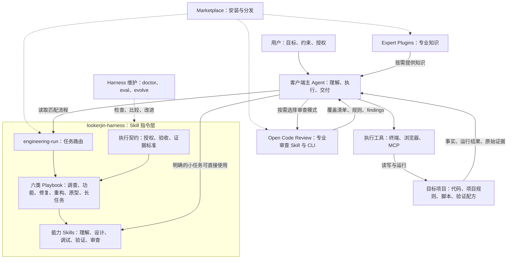
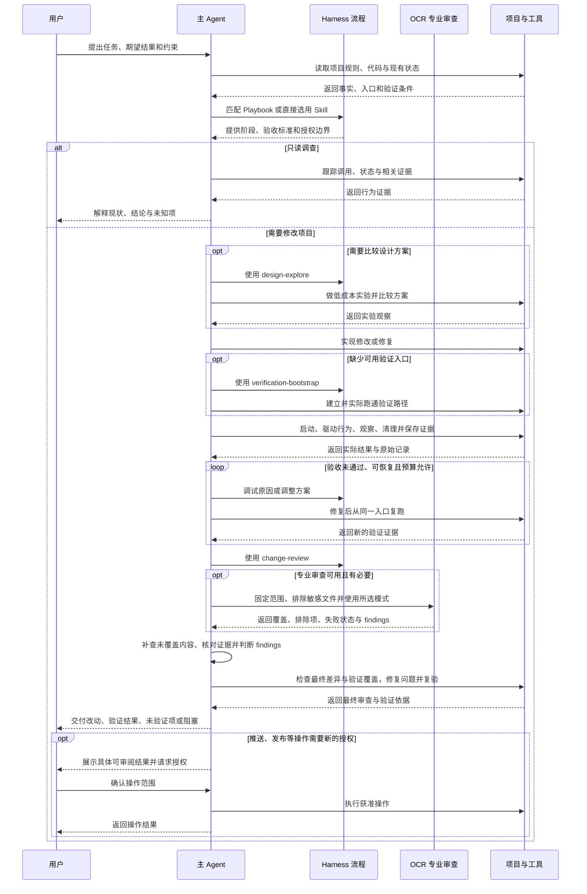

# 轻量工程执行层

本次扩展保持现有 Plugin、Marketplace 和 Expert Plugin 边界。新增的执行逻辑使用普通 Skill 和按需 references，不引入独立 runtime、Hook、顶层协议或插件间依赖。

## 架构图

客户端主 Agent 负责理解任务、调用工具和交付结果；软件工程 Domain Harness 提供领域任务路由、能力组合、验收与证据标准；目标项目保存具体代码、规则和验证配方。专业知识与专业审查由独立插件提供，领域负责人核对其结果并收敛。下图表达职责和信息关系，Skill 之间的连线不代表独立服务或 Plugin-to-Plugin 调用协议。

Context7 是本插件配置的外部文档 MCP；其他执行工具由客户端提供。专家与审查插件由 Marketplace 和客户端按需组合，不是本插件的强制依赖。OCR 默认优先委托模式，主 Agent 完成推理；完整模式使用已选择的外部模型。专业 findings 不替代领域验收或项目运行证据；详细约定以 [OCR 适配](../skills/change-review/references/open-code-review.md) 为准。`pstack` 是设计参考来源，未接入为运行依赖。

## 泳道用户旅程图

用户通过自然语言描述目标，主 Agent 选择匹配流程并按需读取能力。Harness 泳道表示读取领域流程；OCR 泳道表示使用专业审查能力，委托模式的推理仍由主 Agent 完成；项目与工具泳道表示实际执行。读规则不等于已运行对应能力，具体结果仍须有实际证据。

- 验收证据区分 `VERIFIED`、`NOT_VERIFIED` 和 `INCONCLUSIVE`；构建成功或 HTTP 200 不能单独证明完整行为。遇到外部阻塞或无法继续验证时，交付当前结果和最小解除动作。
- 长任务按 Units 推进，先完整执行和验证一个代表性 Unit，再扩大范围；最终复验整体完成条件。子 Agent、多模型和并行取决于当前客户端能力与授权。
- Doctor、Eval、Evolve 属于维护流程，按相应触发条件使用，不在每个任务结束后自动运行，也不自动晋升经验。
- 图展示当前 Skill 定义的职责与路径；跨客户端自动触发仍未实测。实际运行覆盖和限制以 [field-tests](field-tests.md) 为准。

## 权威位置

| 内容 | 位置 |
|---|---|
| 意图路由与能力组合 | [engineering-run](../skills/engineering-run/SKILL.md) |
| 各类任务阶段 | engineering-run/references/playbooks/ |
| 共同授权、证据与验证语义 | [execution-contract](../skills/engineering-run/references/execution-contract.md) |
| 具体项目怎么运行与验证 | 项目现有 scripts / CI / 验证配方 |
| 自动经验晋升门槛 | [promotion-policy](../skills/harness-evolve/references/promotion-policy.md) |
| 行为比较方法 | [harness-eval](../skills/harness-eval/SKILL.md) |
| 领域验收与 OCR 组合 | [change-review](../skills/change-review/SKILL.md) / [OCR 适配](../skills/change-review/references/open-code-review.md) |
| 实际实验结果 | [field-tests](field-tests.md) |

AGENTS 继续约束插件维护，Project Bootstrap 的 engineering-defaults 继续提供目标项目规则素材；不把执行契约复制成另一份全局原则。

## 参考源码

先在云端拉取 `cursor/plugins`，固定到 `fae2c6ed95821bd85f614a73e4842e13229fa5e5`，阅读本地 `pstack` 0.15.5。下表链接均固定该版本。本次按已有 Harness 边界重新编写中文流程，没有复制其 Cursor manifest、agents 或执行 runtime。

| 一手文件 | 吸收内容 | 本实现取舍 |
|---|---|---|
| [poteto-mode](https://github.com/cursor/plugins/blob/fae2c6ed95821bd85f614a73e4842e13229fa5e5/pstack/skills/poteto-mode/SKILL.md) | 意图路由与 Playbook | 仅六类任务，不加载整套原则目录，不自动 PR |
| [bug-fix](https://github.com/cursor/plugins/blob/fae2c6ed95821bd85f614a73e4842e13229fa5e5/pstack/skills/poteto-mode/playbooks/bug-fix.md) | 机制证据与同入口复跑 | 合并进 Root Cause Debug；保留用户 Git 授权边界 |
| [how](https://github.com/cursor/plugins/blob/fae2c6ed95821bd85f614a73e4842e13229fa5e5/pstack/skills/how/SKILL.md) / [why](https://github.com/cursor/plugins/blob/fae2c6ed95821bd85f614a73e4842e13229fa5e5/pstack/skills/why/SKILL.md) | 行为模型与历史约束 | 合成按需 System Understand，不默认七类企业调查 |
| [architect](https://github.com/cursor/plugins/blob/fae2c6ed95821bd85f614a73e4842e13229fa5e5/pstack/skills/architect/SKILL.md) / [arena](https://github.com/cursor/plugins/blob/fae2c6ed95821bd85f614a73e4842e13229fa5e5/pstack/skills/arena/SKILL.md) | 不同结构候选、共同标准、综合与重新设计 | Design Explore，不写死模型，不强制并行 |
| [create-verification-skill](https://github.com/cursor/plugins/blob/fae2c6ed95821bd85f614a73e4842e13229fa5e5/pstack/skills/create-verification-skill/SKILL.md) | 从项目发现 launch/drive/observe/cleanup 并跑通 | 使用项目已有位置和脚本，不默认 Cursor 目录或大量 feature map |
| [interrogate](https://github.com/cursor/plugins/blob/fae2c6ed95821bd85f614a73e4842e13229fa5e5/pstack/skills/interrogate/SKILL.md) | 独立 finding、分歧图与负责人判断 | 加强 Change Review，不新建同义 Skill |
| [eval](https://github.com/cursor/plugins/blob/fae2c6ed95821bd85f614a73e4842e13229fa5e5/pstack/skills/poteto-mode/playbooks/eval.md) | 同任务、版本盲判与原始产物 | 不强制多模型，不删除正常项目测试，不将共享文件系统称为安全隔离 |
| [reflect](https://github.com/cursor/plugins/blob/fae2c6ed95821bd85f614a73e4842e13229fa5e5/pstack/skills/reflect/SKILL.md) | 会话原始证据采集 | 合并进 Evolve，仍需重复发生与归属判断 |
| [orchestrate](https://github.com/cursor/plugins/blob/fae2c6ed95821bd85f614a73e4842e13229fa5e5/pstack/skills/poteto-mode/playbooks/orchestrate.md) | Unit 契约、先跑 pilot | 轻量 Long Run，不实现 ledger/queue/多日调度 |

上游 `pstack/LICENSE` 为 MIT，作者 Lauren Tan。此处记录设计来源；未来直接引入上游实现或大段原文时需要保留其相应版权与许可证。

## 当前边界

这是明确要求的候选改造，不是已经完成跨项目长期晋升。结构和脚本验证、独立夹具行为与真实项目 field test 分别记录。下一步优先在一个真实 bug、一个功能和一个长任务中运行，观察误触发、漏验证与执行成本，再决定调整或删减。
